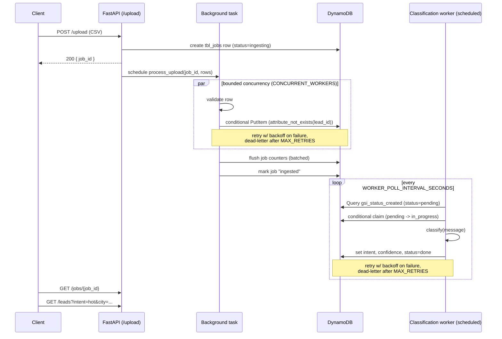

# Async Lead Processing Pipeline

A backend service that ingests sales leads in bulk (CSV, up to 50,000 rows), deduplicates and validates them, classifies each lead's intent (hot/warm/cold) with a trained ML model, and processes everything reliably under simulated database failures — with no lead ever silently lost or processed twice.

## Contents

- [Setup](#setup)
- [Architecture](#architecture)
- [API](#api)
- [Storage design](#storage-design)
- [Data quality rules](#data-quality-rules)
- [Reliability](#reliability)
- [Intent classification](#intent-classification)
- [Performance results](#performance-results)
- [Testing](#testing)
- [What didn't work / what I'd improve](#what-didnt-work--what-id-improve)

## Setup

```bash
pip install -r requirements.txt

# Start DynamoDB Local
docker compose up -d dynamodb

# Create tables (tbl_leads, tbl_jobs, tbl_failed_leads)
python scripts/create_tables.py

# Train the intent classifier (writes models/intent_classifier.pkl)
python -m app.ml.train

# Run the API
python -m app.main
# -> http://127.0.0.1:8001/docs
```

Run the tests (self-contained — spins up an in-memory DynamoDB stand-in, no Docker needed):

```bash
pytest -v
```

Run the Part 6 benchmark:

```bash
python -m scripts.benchmark
```

Key environment variables (see `.env.example`):

| Variable | Default | Purpose |
|---|---|---|
| `SIMULATED_FAILURE_RATE` | `0.0` | Fault injection for retry/DLQ demonstration (Part 5). Set to `0.10` for a 10% simulated write-failure rate. |
| `CONCURRENT_WORKERS` | `10` | Bounded concurrency for CSV ingestion. |
| `WORKER_POLL_INTERVAL_SECONDS` | `10` | How often the classification worker ticks. |
| `WORKER_BATCH_SIZE` / `WORKER_CONCURRENCY` | `100` / `10` | How many pending leads the worker claims and classifies per tick, and how many in parallel. |

## Architecture

Ingestion and classification are two independent, decoupled phases — a lead can sit in `tbl_leads` with `classification_status='pending'` for as long as it takes the scheduled worker to get to it; nothing about `POST /upload` waits on the ML model.



`run_once()` in `app/workers/classification_worker.py` is written as a stateless handler — it reads everything it needs from DynamoDB and takes no arguments beyond that. Locally it's driven by an asyncio loop started from the app's lifespan; the same function could be deployed as-is as a scheduled AWS Lambda (EventBridge cron trigger) without changes.

## API

| Endpoint | Purpose |
|---|---|
| `POST /upload` | Upload a CSV (`name`, `email`, `message` required; `city`, `company`, `phone` optional). Returns a `job_id` immediately. |
| `GET /jobs` | List every upload, most recent first. |
| `GET /jobs/{job_id}` | One upload's ingestion progress: `processed` / `failed` / `duplicates` / `invalid`. |
| `GET /leads` | Browse processed leads. Filters: `city`, `intent`, `date_from`/`date_to`. Cursor-paginated (`page_size`, `cursor` / `next_cursor`). |
| `GET /failed-leads/{job_id}` | Dead-letter queue entries for an upload. |

Pagination is cursor-based, not page-numbered: DynamoDB only supports forward pagination via `LastEvaluatedKey`, so `page=3` isn't a well-defined query without re-reading everything before it. `next_cursor` is an opaque, base64-encoded `LastEvaluatedKey` — pass it back verbatim to fetch the next page.

## Storage design

**`tbl_leads`** — `PK: lead_id`

`lead_id = sha256(email.strip().lower() + "#" + message.strip().lower())` — deterministic, not a random UUID. This single choice is what makes both idempotency and dedup work:

- Re-uploading the same CSV twice produces the same `(email, message)` pairs → same `lead_id` → the conditional `PutItem` (`attribute_not_exists(lead_id)`) rejects it as a duplicate, no new row. This is the Part 2 idempotency requirement.
- A *different* message from the same email → a different `lead_id` → stored as its own lead. A returning contact's new inquiry is never silently dropped by treating "duplicate" as "same email, ever."

GSIs, one per query the API actually needs — no general-purpose index added speculatively:

| GSI | Keys | Serves |
|---|---|---|
| `gsi_status_created` | `classification_status` (H), `created_at` (R) | The scheduled worker's only query: "pending leads, oldest first." Self-shrinking — once a lead's status flips to `done`, it falls out of the `pending` partition automatically. |
| `gsi_intent_date` | `intent` (H), `created_at` (R) | `GET /leads?intent=hot&date_from=...` |
| `gsi_city_date` | `city` (H), `created_at` (R) | `GET /leads?city=...&date_from=...` |

Both `city` and `intent` are *omitted* from an item (not written as `null`) until they have a real value — a GSI key attribute can't hold `NULL`, and leaving it out is what keeps both indexes correctly sparse (unclassified leads don't pollute an intent-based query). When both `city` and `intent` filters are given at once, the query runs against `gsi_intent_date` (assumed the more common business filter — "show me hot leads") and applies `city` as a `FilterExpression`; DynamoDB can't natively query two independent attributes at once without a composite-key index, which felt like over-engineering for this scale.

**`tbl_jobs`** — `PK: list_key` (constant `"JOB"` on every item), `SK: job_id`

One row per upload, not per lead. The constant partition key turns "list every upload" (`GET /jobs`) into a `Query` against one partition instead of a table `Scan`, while `job_id` staying in the key (as the sort key) keeps `GET /jobs/{job_id}` an instant `GetItem`. Trade-off: every job — and every batched counter-flush update during ingestion — lands on the same physical partition, which would throttle at high write volume. Acceptable here because jobs are created per-upload, not per-lead, so volume is orders of magnitude below `tbl_leads`; documented as a deliberate choice, not an oversight.

**`tbl_failed_leads`** (dead-letter queue) — `PK: lead_id`, `SK: failed_at`

Same deterministic id as `tbl_leads`, so a failure record ties directly back to the lead it happened to. The composite key means a lead that fails more than once (e.g. once during ingestion, later again during classification) accumulates a *history* of failures instead of overwriting the last one. `gsi_job_failed` (`job_id` H, `failed_at` R) powers `GET /failed-leads/{job_id}`.

## Data quality rules

- **Invalid**: missing/blank `name`, `email` without an `@`, missing/blank `message`, or either field exceeding its length limit (200 / 5000 chars). Invalid rows are counted (`job.invalid`) but never written to `tbl_leads` — an invalid row can't produce a stable `lead_id` in the first place if it has no email.
- **Duplicate**: identical `(email, message)`, defined via the `lead_id` hash above — not "same email, ever." A follow-up message from a known email is new signal, not noise, so it's kept.

## Reliability

- **Bounded concurrency**: an `asyncio.Semaphore(CONCURRENT_WORKERS)` limits how many leads are in flight at once during ingestion (and `WORKER_CONCURRENCY` similarly for classification) — not unlimited, not one-at-a-time.
- **One lead's failure can't take down its whole batch**: every per-lead task (ingestion row or classification tick) is wrapped so an unexpected exception is caught, logged, and dead-lettered - not left to propagate through `asyncio.gather()`, whose default behavior on an unhandled exception is to abandon every other in-flight task in that same batch. This was found the hard way: setting `SIMULATED_FAILURE_RATE=1.0` for a manual test initially crashed the *entire* worker tick (100 pending leads abandoned) on the very first simulated failure, because the classification worker's atomic "claim" step wasn't covered by any retry/error handling - only the classification write itself was. Fixed, and covered by `test_worker_tick_survives_claim_failures`.
- **Fault injection**: `simulate_write_failure()` (`app/db/dynamodb.py`) rolls a `SIMULATED_FAILURE_RATE` chance of raising before every real DynamoDB write, on every attempt including retries — used to prove the retry path below actually runs, rather than trusting it by reading the code.
- **Retry with backoff**: `MAX_RETRIES=3` attempts, exponential backoff (`RETRY_BACKOFF_BASE * 2^attempt`, capped at `RETRY_BACKOFF_MAX`) — 1s then 2s by default. With a 10% failure rate per attempt, the chance of exhausting all 3 is `0.1³ = 0.1%`, not 10% — retries are what shrink one into the other.
- **Dead-letter queue**: a lead that exhausts all 3 attempts (ingestion *or* classification) is logged to `tbl_failed_leads` with the error and stage — never just dropped.
- **No lead processed twice**:
  - *Ingestion*: the conditional `PutItem` on a deterministic `lead_id` means a retried write (after an ambiguous failure — write actually succeeded, client saw a timeout) collides harmlessly with itself instead of creating a second row under a fresh UUID.
  - *Classification*: the worker first takes an atomic "claim" (`UpdateItem` conditioned on `classification_status = 'pending'`, flipping to `in_progress`). Only one caller can win that conditional update, so two overlapping worker ticks (or two worker processes under multiple uvicorn workers) can never classify the same lead twice.
  - A lead that permanently fails classification is marked `classification_status='failed'` (terminal), not released back to `pending` — otherwise a genuinely broken lead would be retried forever, once per worker tick, rather than surfacing once in the DLQ for a deliberate follow-up.

## Intent classification

`app/ml/train.py`: TF-IDF (max 1000 features) + Multinomial Naive Bayes, trained on `data/leads_labelled.csv` (1,560 labelled messages; 80/20 stratified split).

```
Accuracy: 96.47%

              precision    recall  f1-score   support
        cold       0.95      0.99      0.97       149
         hot       0.94      0.92      0.93        49
        warm       0.99      0.96      0.97       114
```

**`hot` is the class the model struggles with most** — both the lowest precision and recall, and by a wide margin the smallest class in the training set (244 of 1,560 examples, ~16%, vs. 744 `cold`). With fewer examples to learn from, and "hot" messages plausibly sharing vocabulary with strongly-worded "warm" ones ("send me a contract" vs. "send me more info"), the model has the least evidence to draw a confident boundary here — which matters more than it sounds, since `hot` is the business-critical class this whole pipeline exists to surface.

## Performance results

Machine: Windows 11, AMD64 (16 logical CPUs), 15.9 GB RAM, Python 3.12.9.

`BENCHMARK_ROWS=50000 DYNAMODB_ENDPOINT=http://localhost:8000 python -m scripts.benchmark`, run against **real DynamoDB Local** (`docker compose up -d dynamodb`), the full 50,000 rows from `docs/leads_50k.csv`:

| Run | Time | Throughput | processed / duplicates / invalid / failed |
|---|---|---|---|
| Sequential (`CONCURRENT_WORKERS=1`) | 111.81s | 447.2 leads/sec | 41645 / 3481 / 4874 / 0 |
| Concurrent (`CONCURRENT_WORKERS=20`) | 73.22s | 682.9 leads/sec | 41645 / 3481 / 4874 / 0 |
| Concurrent + 10% simulated write failures | 76.08s | — | 41606 / 3474 / 4874 / **46** |

**Speedup from concurrency: 1.53x.** (An earlier run of this same benchmark against `moto`'s dev server — see below — showed almost no speedup at all; that number was measuring the mock's single-threaded ceiling, not the pipeline. This is the real result.)

With a 10% simulated per-attempt failure rate and `MAX_RETRIES=3`, **46 out of 50,000** leads (0.092%) permanently failed and were dead-lettered — matching the expected `0.1³ = 0.1%` math closely, which is the evidence that retry/backoff is doing its job rather than just being present in the code.

One honest side-effect worth naming rather than hiding: the fault-injection run shows 3,474 duplicates against 3,481 in the clean runs — 7 fewer. `simulate_write_failure()` fires on *every* write attempt, including ones that would have resolved as a duplicate via `ConditionalCheckFailedException` — so a handful of rows that were "supposed" to end up as duplicates instead got unlucky on all 3 attempts before the conditional check ever got to run cleanly, and landed in the DLQ instead. Not a bug — it's what "check happens on every attempt" actually implies — but it means the failed/duplicate split has a small amount of genuine randomness at the boundary between those two categories under fault injection specifically.

## Testing

`pytest -v` — 13 tests, no external services required. Isolation strategy: `moto`'s `@mock_aws` decorator does **not** work with `aioboto3`/`aiobotocore` (it patches the synchronous HTTP stack only — confirmed by hand, it raises `TypeError: object bytes can't be used in 'await' expression`), so tests run `moto.server.ThreadedMotoServer`, a real local HTTP endpoint, and point the app at it via `DYNAMODB_ENDPOINT` exactly like DynamoDB Local. Tables are dropped and recreated before every test for isolation. Coverage: CSV validation, invalid-row counting, dedup, keeping distinct messages from the same email, job listing/404, deterministic retry-then-succeed and permanent-failure-to-DLQ (via a monkeypatched fault injector, not real randomness), the classification worker's claim/classify/complete cycle, and intent-filtered lead listing.

## What didn't work / what I'd improve

- **An earlier draft of this benchmark ran against `moto`'s `ThreadedMotoServer` instead of real DynamoDB Local**, because Docker Desktop's engine wasn't running yet in this environment. That run showed almost no speedup from concurrency (1.04x) - not because the pipeline doesn't parallelize, but because `ThreadedMotoServer` (despite the name) runs a single-process Werkzeug dev server that serves one request at a time regardless of how many concurrent `aioboto3` calls the app makes. Once Docker Desktop was started and the benchmark re-run against the real container, the same code showed a genuine 1.53x speedup. Lesson: a benchmark is only as honest as the thing standing in for the real dependency - worth double-checking what's actually being measured before trusting a number, mock included.
- **`GET /leads` with neither `city` nor `intent` given falls back to a table `Scan`.** DynamoDB can't serve "everything, paginated, no filter" from either GSI without adding a third constant-partition-key index — the same trick used for `tbl_jobs` — and I chose not to add one speculatively for a query the spec's filters don't explicitly require. If unfiltered browsing turned out to be a common real path, that's the fix.
- **`tbl_jobs`'s constant partition key is a genuine hot-partition trade-off**, not a free lunch — every job creation and every batched counter flush during ingestion contends for the same partition's write throughput. Fine at "one row per upload" volume; would need sharding (e.g. `list_key = "JOB#2026-09"`, one partition per month) if upload volume ever got large.
- **A permanently-failed classification lead is never automatically retried** — it's marked `classification_status='failed'` and left there so the worker doesn't hammer it forever. There's no operator-facing "requeue from DLQ" endpoint yet; today that's a manual `UpdateItem` back to `pending`.
- **The classification worker runs in-process** (an asyncio task started from the app's lifespan) rather than as an actual deployed Lambda on a schedule — `run_once()` is written to be lift-and-shipped as-is, but I didn't wire up real EventBridge/Lambda infrastructure for this submission.
